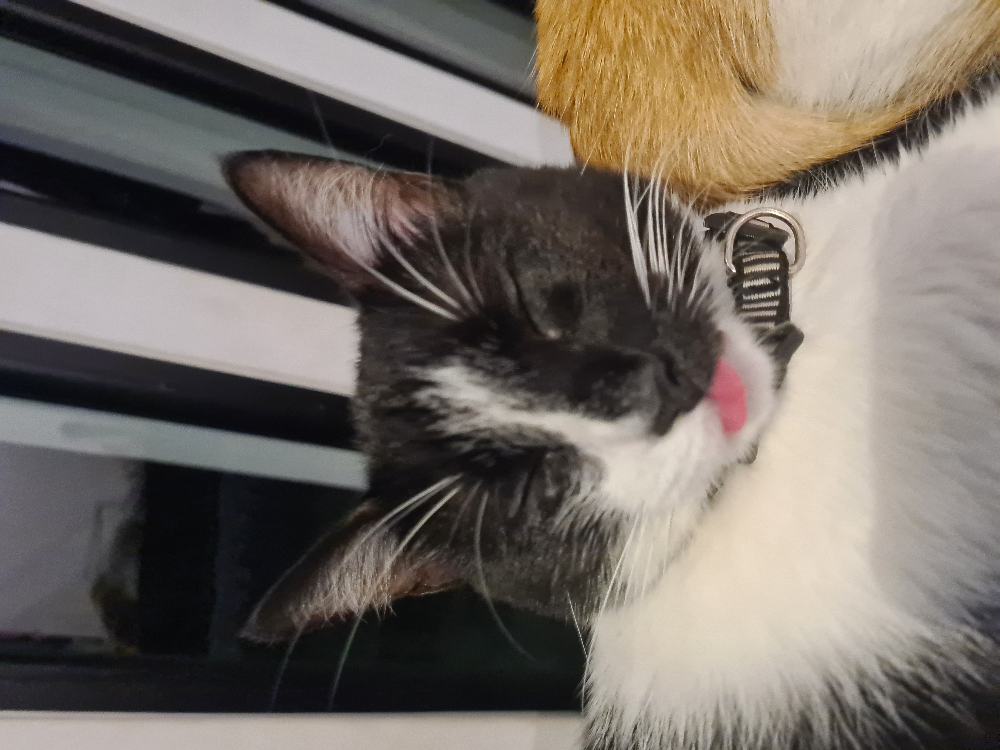
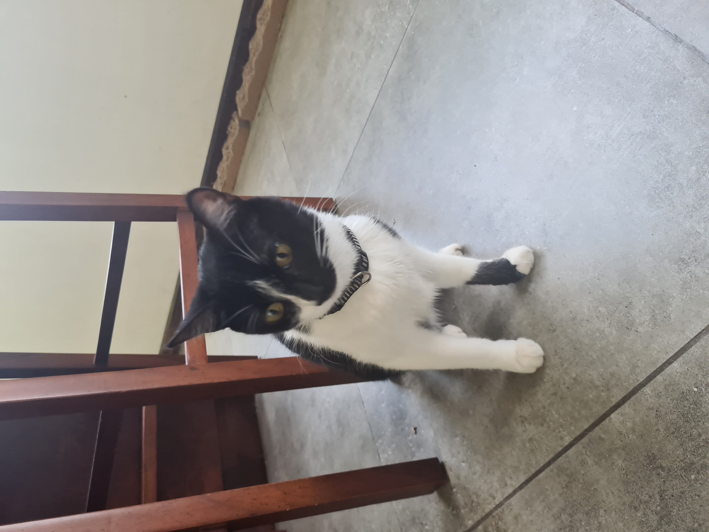
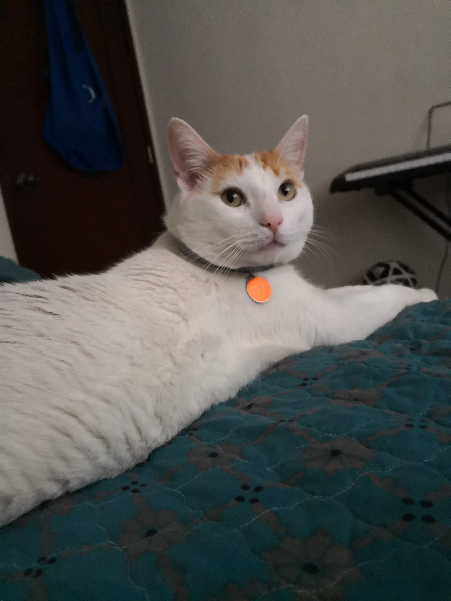
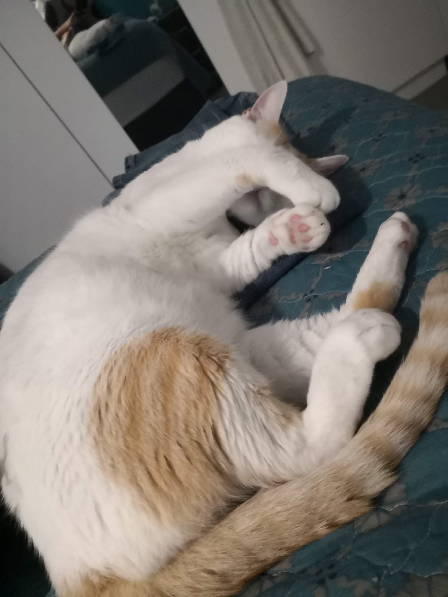

# AI-Cat-Classifier

## Project Overview

This project is a cat recognition system that uses a deep learning model to classify which of my two cats appears in a video. The goal was to build a fun project to learn about computer vision, deep learning, and model deployment. 

The system works by processing each frame of a video, predicting class probabilities with a trained convolutional neural network, and overlaying the results on the output video. At the top of the frame, the model's confidence scores are displayed, while a black strip at the bottom show the cat it believes is most likely present at the moment. 

Although developed around my own cats, the project demonstrates transferable skills in image classification, dataset creation, training/testing pipelines, and AI visualization techniques. It also highlights challenges such as dataset bias, showing a clear path for improvement. 

### Demo Videos

<h3 align="center">Video Showcase </h3>

  

## Features
- Custom trained deep learning model for classifying between two cats.
- Video frame by frame analysis with predictions generated in real time.
- Class confidence scores are displayed at the top of the output video.
- A black bar at the bottom highlights the cat the model thinks is most likely present.
- End-to-end pipeline: the script loads trained model, processes input video, annotates frames, and saves output video.
- Model trained on a custom dataset of labeled images with preprocessing and augmentation applied.

## Technical Details
### Dataset
- Total images: 280 (140 per cat)
- Images capture different positions, lighting conditions, and angles to improve model robustness.
- **Test Set**: 14 images (7 per cat) set aside for final evaluation
- **Training/Validation split**: 80% training and 20% validation
- **Normalization**: pixel values scaled to [0, 1][1./255]

<table align="center">
  <tr>
    <th>Cleo</th>
    <th>Gataki</th>
  </tr>
  <tr>
    <td>
       
      
    </td>
    <td>
       
      
    </td>
  </tr>
</table>

### Data Augmentation
In order to tackle the problem of having a relatively small data set, data augmentation was used:
- Random horizontal mirroring
- Random rotation (±10%)
- Random zoom (±10%)
- Random contrast adjustment
- Random shifts (horizontal & vertical)

### Model Architecture (Transfer Learning)
- Base model: MobileNetV2
  - `include_top = False`
  - Pretrained weights frozen (`trainable = False`)
- Custom classification head:
  - `GlobalAveragePooling2D`
  - `Dense(128, activation='relu'`
  - `Dropout(0.5)`
  - `Dense(2, activation='softmax')`

### Compilation Settings
- Optimizer: Adam, learning rate = 1e-4
- Loss: Sparse Categorical Crossentropy
- Metric: Accuracy

## Limitations
The model shows a tendency to favor the black cat over the white cat. In particular, it struggles when the white cat appears against light-colored or white backgrounds, where it blends in more easily. Additionally, the model was not trained to recognize both cats simultaneously; when presented with such cases, it typically defaults to predicting the black cat.

These limitations are likely due to the small dataset size and data imbalance in background contrast. Most training images were collected in a home environment with light-colored walls and furniture, which provided stronger contrast for the black cat but made it harder for the white cat to be distinguished.

## Future Improvements
- Expand the training data set and collect more balanced data between cats
- Experiment with bounding boxes instead of classification
- Deploy model in real time with webcam feed

## Acknowledgements
- This project uses MobileNetV2, a pretrained convolutional neural network developed by Google, as the base for transfer learning..
- Thanks to TensorFlow/Keras for providing the deep learning framework.
- Inspired by CS50AI "Traffic" course project.
- Special thanks to my cats for being patient test subjects. 

